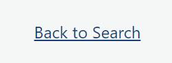

# Project Website Manual 

# Goal
The website is designed to provide a platform for investors to gain important stock-information and build a personalzied stock porfolio in a user-friendly approach. The user would be able to track important information about their stock lists such as current price. Below is an example of an investor's portfolio. 

# User Instructions 

### Home Page 
The home page will display three buttons with clear titles: explore daily top gainers, Build your porfolio, and your potfolio 

### Explore Daily Top Gainers Page 
After clicking the explore daily top gainers buttons on the home page, user will be directed to a new route showing today's top 10 performance stocks and the relevant financial matrix. This will give the user an idea of the recent stocks with high return and performance. 

### Build Your portfolio page 
After clicking the build your potfolio page, user will be directly to a search page where they will be able to search for the stock's information by entering the stock's symbol. 

A list of information related to the stock will then be displayed in a box with a button on the bottown shwon as "add to porfolio". You can return to the search page by clicking on 'back to search'

After clicking on the 'add to portfolio' button, you will be directly to your own porfolio with your list of added stocks 
There's also a 'back to seach' function for you to return to search page to continue adding stock 

### Your porfolio page
The user will be able to directly access their porfolio to view their stocks by clicking the 'Your Potfolio' Button from the home Page 

# Project Code Narrative 
The website is constructed using important topics learned from the software design course -- API and Flask implementation. 
 
First, we fetched key financial data such as real-time price of each stock and the daily top performance stocks from yfiannce and yahoo_fin API. 

Then, we extracted the most important info we want to display for our user through the helper function. 

The last step was to build a flask web applciation that emphasizes heavily on creating a user-friendly and interactive experience. We used boostrap to improve the design of our website and added HTML features to link the different pages to our home page, which made it very easy for users to navigate the different functions we built for the website. 

We also made sure we included a return function so that it's easier for user to go back and forth different pages as our 'build your portfolio' function encompasses three different pages.

